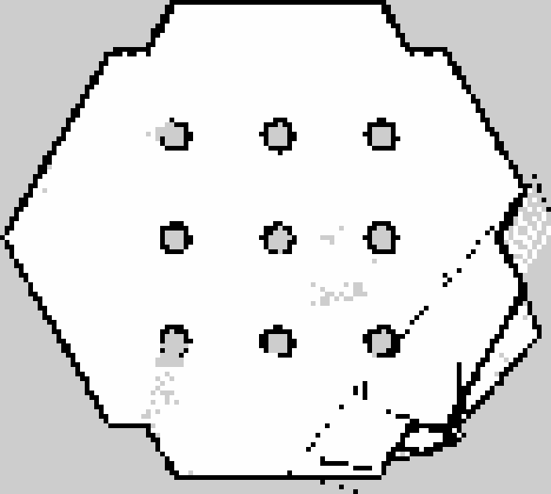
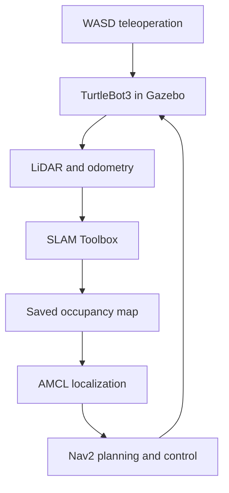

# Autonomous Indoor Service Robot

[](https://docs.ros.org/en/humble/)
[](https://classic.gazebosim.org/)
[](https://emanual.robotis.com/docs/en/platform/turtlebot3/overview/)
[](#development-status)

A ROS 2 mobile-robot simulation for LiDAR mapping, localization, and autonomous navigation in a custom multi-room office environment.

> **Current milestone:** A TurtleBot3 Burger can map the simulated environment with SLAM Toolbox, localize against a saved occupancy map with AMCL, and execute point-to-point navigation goals through Nav2.

## Why this project

Reliable indoor autonomy requires several robotics subsystems to work together: simulation, sensing, coordinate transforms, mapping, localization, planning, and control. This project integrates those components into a reproducible ROS 2 workflow and provides a foundation for multi-stop service missions and navigation benchmarking.

## Implemented capabilities

| Area | Implementation |
| --- | --- |
| Simulation | TurtleBot3 Burger in Gazebo Classic with a custom multi-room office world |
| Mapping | 2D LiDAR occupancy-grid mapping with SLAM Toolbox and persistent map export |
| Localization | AMCL localization against the saved map |
| Navigation | Nav2 point-to-point planning and closed-loop motion control |
| Teleoperation | Custom responsive WASD ROS 2 node with key-release stopping and an emergency stop |
| Environment | Versioned Gazebo worlds plus a Dockerfile for a ROS 2 Humble toolchain |

## Current result

The repository includes the occupancy map produced during an initial simulation SLAM run. Black cells are occupied, white cells are free space, and gray cells are unknown.



The custom office world is committed separately. Mapping that world again and recording the complete Gazebo/RViz workflow are the next presentation milestones.

## System architecture



## Quick start

The primary environment is Ubuntu 22.04 with ROS 2 Humble and Gazebo Classic. See [the complete setup guide](docs/setup.md) for package installation, mapping, map saving, Nav2, Docker, and troubleshooting.

```bash
git clone https://github.com/anuj519/autonomous-indoor-service-robot.git
cd autonomous-indoor-service-robot

source /opt/ros/humble/setup.bash
export TURTLEBOT3_MODEL=burger

gazebo --verbose worlds/office_fasttrack.world \
  -s libgazebo_ros_init.so \
  -s libgazebo_ros_factory.so
```

In a second sourced terminal, spawn the robot:

```bash
ros2 run gazebo_ros spawn_entity.py \
  -entity burger \
  -database turtlebot3_burger \
  -x 0 -y 0 -z 0.01
```

For responsive manual driving, open another sourced terminal:

```bash
python3 scripts/wasd_teleop.py
```

| Key | Command |
| --- | --- |
| `W` / `S` | Forward / reverse |
| `A` / `D` | Turn left / right |
| `Q` / `E` | Forward-left / forward-right |
| `Space` | Stop immediately |
| `X` | Stop and exit |

## Repository guide

| Path | Purpose |
| --- | --- |
| `worlds/office_fasttrack.world` | Primary custom multi-room Gazebo environment |
| `worlds/office_v1.world` | Earlier baseline world retained for comparison |
| `maps/my_map.yaml` and `maps/my_map.pgm` | Saved SLAM occupancy map and metadata |
| `scripts/wasd_teleop.py` | Responsive ROS 2 keyboard teleoperation node |
| `docker/Dockerfile` | ROS 2 Humble simulation and navigation dependencies |
| `docs/setup.md` | Full setup and operating workflow |
| `docs/progress.md` | Completed milestones, limitations, and planned work |

## Development status

This is an active project. Completed functionality and planned work are separated below so the current scope is clear.

### Completed

- [x] Configure ROS 2 Humble, Gazebo Classic, and TurtleBot3 Burger
- [x] Build a custom multi-room office world
- [x] Implement responsive WASD teleoperation
- [x] Generate and save a 2D LiDAR occupancy map with SLAM Toolbox
- [x] Localize the robot with AMCL
- [x] Execute point-to-point navigation goals with Nav2

### In progress

- [ ] Package repeatable launch workflows
- [ ] Implement a multi-waypoint service-mission node
- [ ] Test blocked-path behavior and navigation recovery
- [ ] Measure success rate, completion time, and path length across repeated trials
- [ ] Record an end-to-end Gazebo/RViz demonstration

### Future extensions

- [ ] Behavior-tree mission logic and failure handling
- [ ] Object-detection integration
- [ ] Optional Raspberry Pi and physical-sensor deployment

Detailed milestone notes are available in [docs/progress.md](docs/progress.md).

## Scope and limitations

- The current implementation is simulation-only.
- SLAM Toolbox, AMCL, and Nav2 are integrated ROS 2 packages; this project does not claim to implement those algorithms from scratch.
- Multi-goal missions, dynamic-obstacle experiments, recovery evaluation, and quantitative benchmarking are not yet complete.

## Author

Built by [Anuj Arora](https://github.com/anuj519) as an independent robotics portfolio project.
